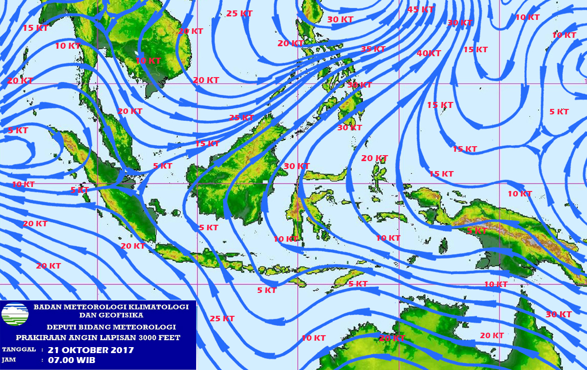

# BMKG Wind Map Scrapper

Simple shell script to scrap map image from BMKG (Badan Meteorologi Klimatologi dan Geofisika).

## How to Use

Run this script as cronjob as the map data is updated daily. The server itself doesn't log the map, so we can't scrap older data.

## Example Data

